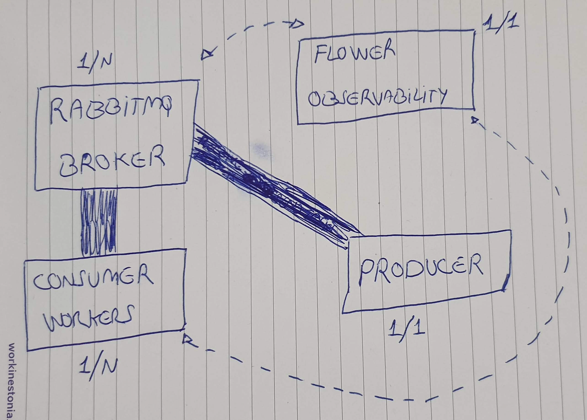
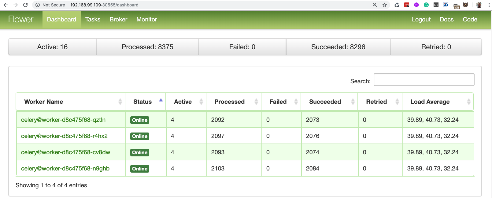
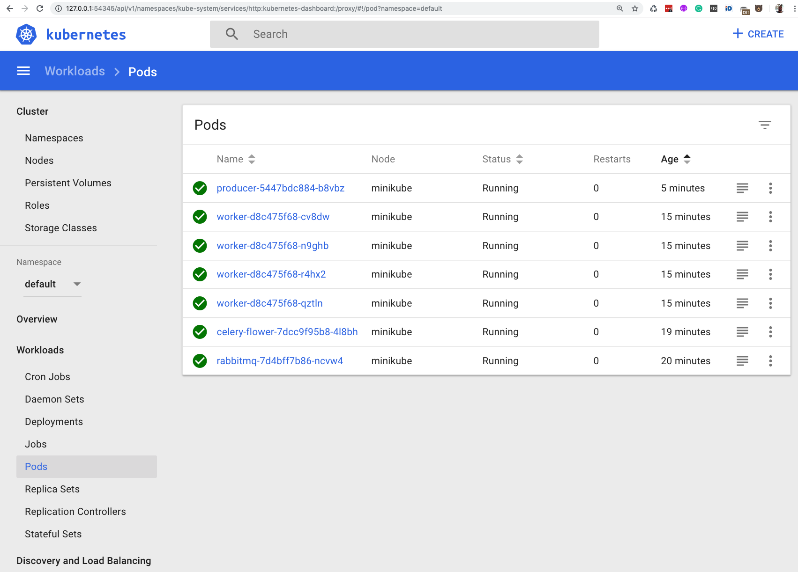
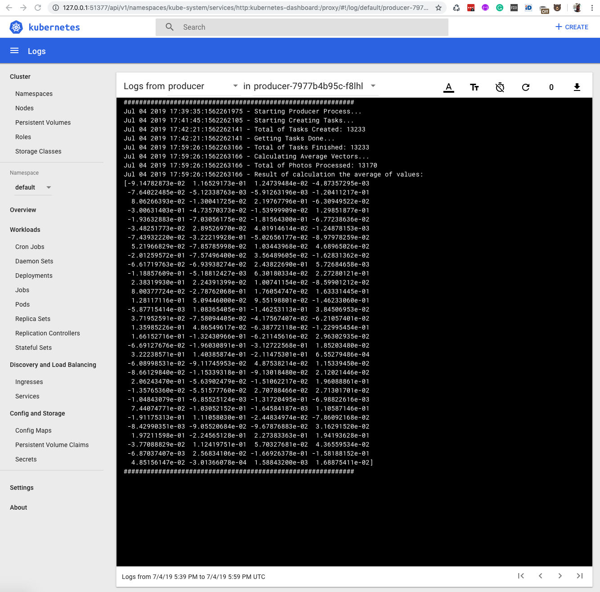

# Introduction

This is the documentation regarding the challenge proposed by **Veriff** to **Senior Python Engineer** position to calculate the value of the average face embedding vector across a large dataset of faces/photos.

## Architecture


This is the first release of the architecture proposal. Each box have an indicator that defines the factor of scalability, for example, 1/1 - Minimal/Maximum;

**Note:** Regarding of this challenge, was used a MacBook Pro, the tools mentioned in this document, and the code created respecting the requirements received.

### RabbitMQ

The first component is the RabbitMQ service that works as a Broker, receiving messages to share between **Producer** and **Workers**. RabbitMQ is the base of data consumed by **Flower** also. To the future is possible to clusterized this service to attend the 1/n salability requirement but for reasons of resources in this challenge will use only one container.

### Workers

The workers have the goal to process any task that was sent to them. It is the first service used in this challenge to accelerate, parallelizing the tasks of the challenge attending the scalability requirement. Was used 4 containers to process face recognition.

### Producer

The producer is only a container that will download the dataset, validate, extract, and submit each photo as a task. After the process of photos are finished the producer can calculate the average of all faces. To this challenge was an option to don't parallelize this container but in the future is possible to elevate the scalability factor of this service.

### Flower

The Flower is used to allow the operators to have more information about what's in process with a bunch of substantial metrics. Observability is the best description of what this tool can offer to us.

## REQUIREMENTS

The requirements necessary to reproduce, test or run the solution:

* MacBookPro with minimal 16gb of RAM and 4 CPUs running the macOS Mojave
* VirtualBox
* Minikube
* Docker
* Minimal Python 3.6

**Node:** I'll not mention the standard configuration of the tools. All custom configurations will be included below.

## Deployment

The first action to reproduce this workforce will be clone the repositorie below:

https://github.com/firemanxbr/veriff

After attending all requirements, installing and configuring the tools using the official documentation from each place, we can start our kubernetes/minikube.

### Minikube

```code
$ minikube start --vm-driver virtualbox --disk-size 50G --cpus 4 --memory 12000 -v=10
...
🚜  Pulling images ...
🚀  Launching Kubernetes ...
⌛  Verifying: apiserver proxy etcd scheduler controller dns
🏄  Done! kubectl is now configured to use "minikube"
```

Getting the IP used to open the tools of our architecture:

```code
$ minikube status
host: Running
kubelet: Running
apiserver: Running
kubectl: Correctly Configured: pointing to minikube-vm at 192.168.99.103
```

The IP used on minikube-vm will be used to access the web interfaces in this project.

We can use the minikube dashboard to analyze the use of our resources by kubernetes:

```code
$ minikube dashboard
🔌  Enabling dashboard ...
🤔  Verifying dashboard health ...
🚀  Launching proxy ...
🤔  Verifying proxy health ...
🎉  Opening http://127.0.0.1:49926/api/v1/namespaces/kube-system/services/http:kubernetes-dashboard:/proxy/ in your default browser...
```

### Kubernetes/Minikube

Inside of the repository will exist a folder named **kube/**, where will allow us to deploy our containers:

```code
$ kubectl apply -f infra.yaml
service/rabbitmq created
deployment.extensions/rabbitmq created
persistentvolume/task-pv-volume unchanged
persistentvolumeclaim/task-pv-claim unchanged
```

Please wait the RabbitMQ will be running to continue deployment the other containers. How to check the RabbitMQ container?

```code
$ kubectl get pods
NAME                        READY   STATUS    RESTARTS   AGE
rabbitmq-7d4bff7b86-vscjw   1/1     Running   0          95s
```

When RabbitMQ(The Broker) it's running and ready to use we can deploy the workers and the flower:

Workers:

```code
$ kubectl apply -f worker.yaml
deployment.extensions/worker created
```

Flower:

```code
$ kubectl apply -f flower.yaml
deployment.extensions/celery-flower created
service/celery-flower created
```

### Flower

The web interface of Flower can be accesible using the IP of minikube VM, for example:

http://192.168.99.109:30555/dashboard



Using this tool is possible to see each task sent by **Producer**, in process or finished by **Workers**.

### Minikube Dashboard

The Minikube Dashboard is used to management the containers and see the logs inside of a container. In this challenge this access is so important.



### Start the process

To start the process will be necessary only deploy the **Producer** container because it is responsable to send tasks to the RabbitMQ/Celery and receive the results from the Workers. How to start?

```code
kubectl apply -f producer.yaml
deployment.extensions/producer created
```

Afert that is possible to see all containers in perfect operation:

```code
$ kubectl get pods
NAME                             READY   STATUS    RESTARTS   AGE
celery-flower-7dcc9f95b8-4l8bh   1/1     Running   0          27m
producer-5447bdc884-b8vbz        1/1     Running   0          13m
rabbitmq-7d4bff7b86-ncvw4        1/1     Running   0          28m
worker-d8c475f68-cv8dw           1/1     Running   0          23m
worker-d8c475f68-n9ghb           1/1     Running   0          23m
worker-d8c475f68-qztln           1/1     Running   0          23m
worker-d8c475f68-r4hx2           1/1     Running   0          23m
```

### Checking the Results/Logs

The image below is the logs of the **producer** container:



Into the Flower web interface is possible to check in details all tasks sent, received, processed and returned to the **producer** container:


## Report and metrics reached

Following below the numbers generated with this domestic hardware and resources. With more time and resources will be substantially increased these numbers could be better:

IMAGES HERE!!!!

## TODO/Bottlenecks

Some suggestions to improve the current solution:

* Create a better human interface to manage the whole process. (API + Swagger + Flask)
* Create a cluster to RabbitMQ service.
* Create a cluster to Producer service.
* Improve the control of Exceptions and use of hardware resource.
* Implementing the CI and gateways of software quality(pylint, pep8, pyflakes).
* Implementing the automation to build the new container images.
* Implementing the CD process to delivery automaticly the new releases generate on Git repository.
* Improve the limitations of resources in use by containers in general.
* Implement the configuration maps inside of Kubernetes.
* Add credentials to Secrets of Kubernetes or another KeyVault solution.
